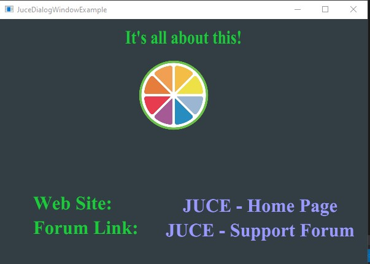

# Juce Dialog Window Example

This example shows how to create a dialog using a JUCE component as the dialog, using two different methods.

The first method is considered out dated and *shouldn't* be used inside a plugin.
The second method uses a safer way of calling the dialog and is the preffered way.

This example aslo demonstrates how to store and recall an image in the binary executeable.

This would be an alternative to using the JUCE AlertWindow, which in most cases
probably would suffice.

After cloning the project, just open the .jucer file and set your exporter.

Provided by GNU-3 Open Source.